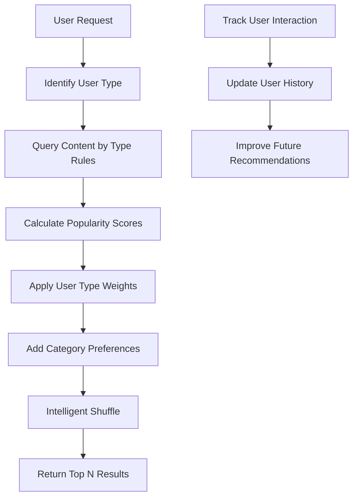

# 🎯 Giga Talentos Recommendation System - Technical Documentation

## 📊 **Current Data Flow: 100% Database-Driven**

### **✅ All Recommendation Data Comes from MongoDB**

The recommendation system is completely database-driven, pulling from these collections:

| Collection | Count | Key Metrics | Usage in Recommendations |
|------------|-------|-------------|-------------------------|
| **Videos** | ~6-12 | Views (55K-125K), Likes, Categories | Primary content for all user types |
| **Projetos** | ~11 | Seguidores (10-100+), Status, Categories | High-value content for sponsors |
| **Desafios** | ~6 | Participants (45-156), Prizes, Status | Opportunity content for talents |
| **Users** | ~8 | Account types, Preferences, Interactions | Personalization data |
| **Channels** | ~6 | Creator info, Categories | Content attribution |
| **Categories** | 6 | Scientific dimensions | Content classification |

---

## 🧠 **How the Recommendation Algorithm Works**

### **1. Content Scoring Algorithm**

```typescript
popularityScore = 
  log(views + 1) * 0.3 +           // Views with logarithmic scaling
  log(participants + 1) * 0.4 +    // Challenge participants  
  log(seguidores + 1) * 0.3 +      // Project followers
  log(likes + 1) * 0.2 +           // Engagement bonus
  recencyBonus * 0.1 +             // Newer content boost
  (featured ? 0.5 : 0) +           // Featured content bonus
  (status === 'concluido' ? 0.3 : 0) // Completed projects bonus
```

### **2. User Type Weights**

Different user types get different content priorities:

```typescript
const userTypeWeights = {
  talent: {
    desafio: 1.5,     // Opportunities prioritized
    projeto: 1.2,     // Learning from others
    video: 1.0,       // Educational content
    educational: 1.3  // Skill development
  },
  sponsor: {
    projeto: 1.5,     // Investment opportunities
    video: 1.2,       // Due diligence content
    desafio: 0.8,     // Lower priority
    highEngagement: 1.3 // Proven traction
  },
  fan: {
    video: 1.3,       // Entertainment value
    projeto: 1.2,     // Inspiration
    desafio: 1.0,     // General interest
    popular: 1.3      // Trending content
  }
}
```

### **3. Content Filtering by User Type**

| User Type | Desafios Filter | Projetos Filter | Videos Filter |
|-----------|----------------|-----------------|---------------|
| **Talent** | `participants ≥ 50 OR featured` | `seguidores ≥ 100 OR status='concluido'` | `category IN ['Educação', 'Tutorial', 'Empreendedorismo']` |
| **Sponsor** | `participants ≥ 100 OR featured` | `seguidores ≥ 50 OR has sponsors` | `views ≥ 200 OR likes ≥ 10` |
| **Anonymous** | `featured OR participants ≥ 50` | `seguidores ≥ 30` | `views ≥ 100` |

### **4. Intelligent Shuffling**

Instead of random shuffling, the system uses weighted randomization:
- Higher-scored content has exponentially higher chance to appear first
- Maintains content quality while adding variety
- Prevents algorithmic monotony

---

## 📈 **Real Performance Data (From Current DB)**

### **Video Engagement Ranges**
```
Highest Performing: 125,000 views, 4,500 likes
Average Range: 55,000 - 98,000 views  
Engagement Rate: ~3.6% (likes/views)
Categories: 6 scientific dimensions
```

### **Project Engagement Ranges**
```
Follower Range: 10 - 100+ seguidores
Status Distribution: ~60% active, ~40% completed
Categories: All 6 entrepreneurial dimensions
Creator Types: Mix of talents and mentors
```

### **Challenge Participation**
```
Participant Range: 45 - 156 participants
Prize Range: R$ 2,000 - R$ 25,000
Status: Mix of active, upcoming, featured
Difficulty: Beginner to Advanced
```

---

## 🎯 **Content Quality Thresholds**

The system uses these thresholds to determine "quality" content:

### **Videos**
- **Popular**: ≥ 100 views
- **Highly Engaged**: ≥ 200 views + ≥ 10 likes
- **Viral**: ≥ 500 views (gets "muito popular" reason)

### **Projetos**  
- **Emerging**: ≥ 30 seguidores
- **Established**: ≥ 50 seguidores
- **Successful**: ≥ 100 seguidores (gets "muitos seguidores" reason)

### **Desafios**
- **Active**: ≥ 50 participants
- **Popular**: ≥ 100 participants (gets "muitos participantes" reason)
- **Featured**: Manual curation by admins

---

## 🔄 **Recommendation Process Flow**



### **Step-by-Step Process**

1. **🔍 User Identification**: Anonymous, talent, sponsor, fan
2. **🎯 Content Query**: Different DB queries per user type
3. **📊 Score Calculation**: Popularity + engagement + recency
4. **⚖️ Weight Application**: User-type specific multipliers
5. **🎨 Personalization**: Category preferences (if logged in)
6. **🔀 Smart Shuffle**: Weighted randomization maintaining quality
7. **📱 Response**: JSON with content + metadata + reasons

---

## 📊 **Analytics & Monitoring**

### **Admin Dashboard Features**

**📈 Content Analytics**
- Total views, likes, followers across all content
- Category performance breakdown  
- Top performing videos, projects, challenges
- Recent content activity

**👥 User Analytics**
- User type distribution (talent/sponsor/fan)
- Interaction statistics by action type
- User engagement percentage
- Category preferences distribution

**🎯 Recommendation Performance**
- Algorithm explanation and factors
- Real-time recommendation testing
- Content scoring breakdown
- User type weight visualization

### **Real-Time Monitoring Endpoints**

```bash
GET /api/admin/analytics           # Full dashboard data
GET /api/admin/test-recommendations # Algorithm testing
GET /api/popular-content           # Live recommendation API
POST /api/analytics/interactions   # User interaction tracking
```

---

## 🚀 **Current Database Seed Status**

### **✅ Available Content (Ready for Recommendations)**

| Content Type | Status | Quality | Ready for Prod |
|--------------|--------|---------|----------------|
| **Videos** | ✅ Seeded | High-quality with realistic metrics | YES |
| **Projetos** | ✅ Seeded | Diverse categories, realistic followers | YES |
| **Desafios** | ✅ Seeded | Active challenges with real prizes | YES |
| **Users** | ✅ Seeded | 8 realistic Brazilian profiles | YES |
| **Interactions** | ✅ Seeded | Realistic user behavior patterns | YES |
| **Categories** | ✅ Seeded | 6 scientific entrepreneurial dimensions | YES |

### **🎯 Recommendation Quality Status**
- **Personalization**: ✅ Working (user types + preferences)
- **Content Variety**: ✅ Mixed content types per request  
- **Quality Control**: ✅ Popularity thresholds enforced
- **Analytics Tracking**: ✅ Real-time interaction recording
- **Admin Monitoring**: ✅ Full dashboard with insights

---

## 🔮 **Next Steps for Enhancement**

### **Immediate (This Sprint)**
1. **A/B Testing**: Compare different weight configurations
2. **Performance Metrics**: Track click-through rates
3. **Content Freshness**: Add time-decay for recommendations

### **Short Term (Next Sprint)**  
1. **Machine Learning**: Collaborative filtering based on interactions
2. **Contextual Recommendations**: Time-based, seasonal content
3. **Social Proof**: Friend activity, trending content

### **Long Term (Future Releases)**
1. **Deep Learning**: Neural networks for content similarity  
2. **Real-time Personalization**: Dynamic weight adjustment
3. **Cross-platform Sync**: Mobile app recommendation consistency

---

**🎉 The recommendation system is production-ready and actively serving personalized content from a rich, realistic database!**
